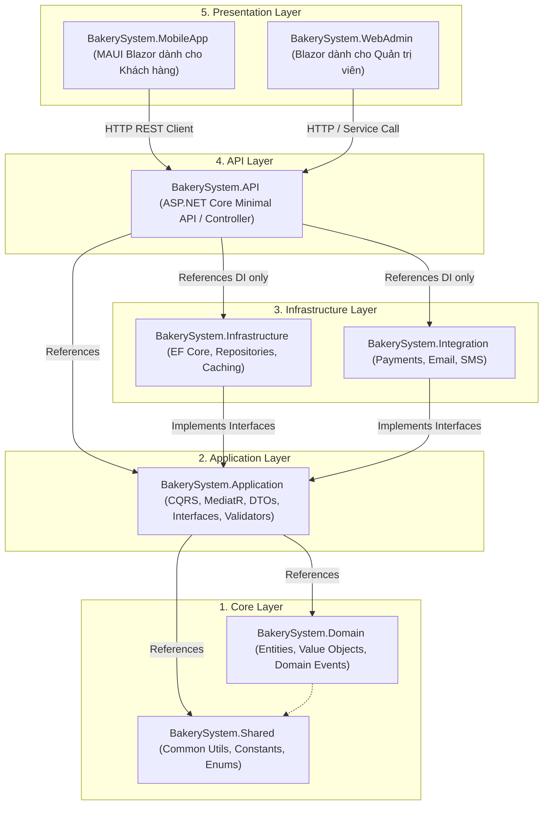
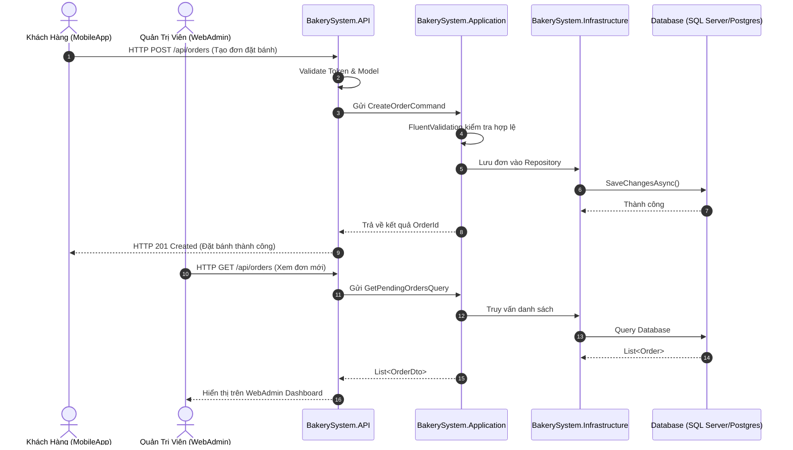

# Kiến trúc hệ thống BakerySystem (Clean Architecture)

Tài liệu thiết kế kiến trúc kỹ thuật hệ thống **BakerySystem**, áp dụng mô hình **Clean Architecture** (Onion / Hexagonal Architecture) trên nền tảng **.NET 10**.

---

## 1. Tổng quan Kiến trúc

Mục tiêu cốt lõi của Clean Architecture trong BakerySystem là:
- **Độc lập với Frameworks**: Logic nghiệp vụ không bị phụ thuộc vào ASP.NET Core, Entity Framework Core hay bất kỳ thư viện UI nào.
- **Dễ dàng Kiểm thử (Testable)**: Các quy tắc nghiệp vụ (Business Rules) có thể kiểm thử độc lập mà không cần database, web server hay UI.
- **Độc lập với Giao diện (UI-Independent)**: Hệ thống phục vụ 2 đối tượng người dùng qua 2 ứng dụng độc lập:
  - **Quản trị viên & Nhân viên**: Quản lý qua ứng dụng Web Admin (`BakerySystem.WebAdmin` - Blazor).
  - **Khách hàng**: Đặt bánh qua ứng dụng Di động (`BakerySystem.MobileApp` - .NET MAUI Blazor Hybrid).
- **Độc lập với Cơ sở dữ liệu (Database-Independent)**: Có thể chuyển đổi giữa SQL Server, PostgreSQL hoặc NoSQL mà không ảnh hưởng tới Domain và Application.

---

## 2. Sơ đồ Luồng Phụ thuộc (Dependency Flow)

---

## 3. Trách nhiệm chi tiết của từng tầng

### 3.1. Tầng 1: Core (`1.Core`)
- **`BakerySystem.Domain`**:
  - Trái tim của hệ thống, chứa các mô hình nghiệp vụ độc lập:
    - **Entities**: Bánh (Cake/BakeryItem), Đơn hàng (Order), Khách hàng (Customer), Hóa đơn (Invoice), v.v.
    - **Value Objects**: Tiền tệ (Money), Địa chỉ giao hàng (DeliveryAddress).
    - **Domain Events**: `OrderPlacedEvent`, `PaymentCompletedEvent`.
    - **Domain Exceptions**: Ngoại lệ logic nghiệp vụ đặc thù.
  - *Nguyên tắc*: Không tham chiếu bất kỳ thư viện bên ngoài hoặc tầng nào khác.
- **`BakerySystem.Shared`**:
  - Chứa các định nghĩa dùng chung, hằng số, helper thuần túy (DateTime utils, string extensions, pagination wrapper).

### 3.2. Tầng 2: Application (`2.Application`)
- **`BakerySystem.Application`**:
  - Chứa các Ca sử dụng (Use Cases) của hệ thống:
    - Triển khai mô hình **CQRS** (Command Query Responsibility Segregation).
    - Commands: `CreateOrderCommand`, `UpdateProductCommand`.
    - Queries: `GetOrderByIdQuery`, `ListPopularCakesQuery`.
    - DTOs (Data Transfer Objects) và Mappings.
    - Interfaces cho Repositories (vd: `IOrderRepository`, `IUnitOfWork`) và Services (vd: `IEmailService`, `IPaymentGateway`).
    - Validation dữ liệu đầu vào sử dụng **FluentValidation**.
  - *Nguyên tắc*: Chỉ phụ thuộc vào `Domain` và `Shared`.

### 3.3. Tầng 3: Infrastructure (`3.Infrastructure`)
- **`BakerySystem.Infrastructure`**:
  - Hiện thực (Implementation) các interfaces được định nghĩa ở tầng Application:
    - **Persistence**: `ApplicationDbContext` (Entity Framework Core), Migrations, Entity Configurations.
    - **Repositories**: Cụ thể hóa `OrderRepository`, `UnitOfWork`.
    - **Identity & Auth**: JWT Token generator, Identity services.
    - **Caching**: Redis / Memory Cache.
- **`BakerySystem.Integration`**:
  - Tích hợp dịch vụ bên thứ 3:
    - Cổng thanh toán (VNPay, MoMo, Stripe, ZaloPay).
    - Dịch vụ gửi thông báo/email (SendGrid, Twilio).

### 3.4. Tầng 4: API (`4.API`)
- **`BakerySystem.API`**:
  - Cổng kết nối HTTP Backend RESTful API:
    - ASP.NET Core Web API (Controllers hoặc Minimal APIs).
    - Cấu hình Middleware (Global Exception Handler, CORS, Rate Limiting, Authentication/Authorization).
    - Swagger / OpenAPI documentation.
    - Cấu hình Dependency Injection (Wiring giữa Application và Infrastructure trong `Program.cs`).

### 3.5. Tầng 5: Presentation (`5.Presentation`)
Chỉ bao gồm đúng **2 giao diện người dùng**:
1. **`BakerySystem.WebAdmin`**: Giao diện Quản trị viên & Nhân viên (Blazor Server) quản lý đơn hàng, kho bánh, danh mục, doanh thu.
2. **`BakerySystem.MobileApp`**: Ứng dụng di động dành riêng cho Khách hàng (.NET MAUI Blazor Hybrid) để xem menu bánh, đặt hàng, nhận thông báo đẩy và thanh toán trực tuyến trên iOS và Android.

---

## 4. Luồng xử lý một Request (Request Pipeline)

---

## 5. Quy tắc mở rộng & phát triển
1. **Không vi phạm Dependency Rule**: Không bao giờ đưa logic database (EF Core, SQL) vào tầng Domain hay Application.
2. **Interface ở đâu, ai triển khai?**: Interface luôn đặt ở tầng trong (`Application`), triển khai nằm ở tầng ngoài (`Infrastructure`).
3. **Mã hóa bất biến**: Dùng `record` cho Commands/Queries/DTOs; Entities phải bảo toàn tính hợp lệ (invariants) qua private setters và public methods.
